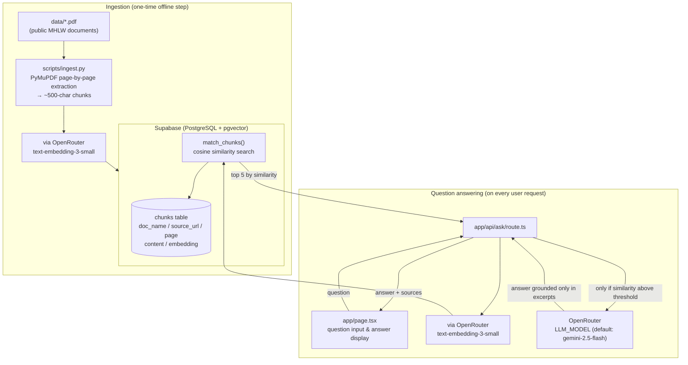

# Care Documents Q&A with Citations (Prototype)

*[日本語版はこちら / Japanese version here](README.md)*

A prototype demo that answers questions about elderly/disability care
procedures (sputum suctioning, tube feeding) in Japanese, grounded in
public documents from Japan's Ministry of Health, Labour and Welfare
(MHLW), with explicit citations (document name, page, link to the
official PDF) for every claim.

## Overview

- The user asks a question in Japanese. The app performs a vector
  search over pre-ingested PDF excerpts and has the LLM generate an
  answer using only those excerpts as grounding.
- Each sentence in the answer carries a citation marker like `[1]`,
  which is clickable and jumps to the corresponding source (document
  name, page, exact excerpt, link to the official PDF).
- If no relevant excerpt is found, the app returns
  "資料に記載がありません。" ("Not found in the documents.") directly,
  without calling the LLM, to prevent hallucination.

## Documents used

Five publicly available MHLW documents related to sputum-suctioning
training are used:

| Document | Source URL |
|---|---|
| Sputum suctioning (Course 3 training text) | https://www.mhlw.go.jp/seisakunitsuite/bunya/hukushi_kaigo/shougaishahukushi/kaigosyokuin/dl/text_03.pdf |
| Tube feeding (Course 3 training text) | https://www.mhlw.go.jp/seisakunitsuite/bunya/hukushi_kaigo/shougaishahukushi/kaigosyokuin/dl/text_07.pdf |
| Sputum suctioning training Q&A (Course 3 training text) | https://www.mhlw.go.jp/seisakunitsuite/bunya/hukushi_kaigo/shougaishahukushi/kaigosyokuin/dl/text_10.pdf |
| Sputum suctioning training curriculum | https://www.mhlw.go.jp/seisakunitsuite/bunya/hukushi_kaigo/seikatsuhogo/tannokyuuin/dl/4-1-1-1.pdf |
| Q&A on sputum suctioning operations (Part 2) | https://www.mhlw.go.jp/seisakunitsuite/bunya/hukushi_kaigo/seikatsuhogo/tannokyuuin/dl/2-6-4-4.pdf |

## Architecture



## Setup

### 1. Prerequisites

- Node.js 18+
- Python 3.10+
- A Supabase project (with the pgvector extension enabled)
- An OpenRouter API key (used for both embeddings and the LLM)

### 2. Install dependencies

```bash
npm install
pip install -r scripts/requirements.txt
```

### 3. Configure environment variables

Copy `.env.example` to `.env` and fill in the values.

```bash
cp .env.example .env
```

| Variable | Description |
|---|---|
| `SUPABASE_URL` | Your Supabase project URL |
| `SUPABASE_SERVICE_ROLE_KEY` | Supabase service_role (secret) key, used by the ingestion script and the API for writes and search |
| `OPENAI_API_KEY` | Used for embeddings. This project calls `openai/text-embedding-3-small` through OpenRouter, so set this to your OpenRouter API key |
| `OPENROUTER_API_KEY` | OpenRouter API key used for LLM calls |
| `LLM_MODEL` | OpenRouter model ID used for answer generation (default: `google/gemini-2.5-flash`) |

### 4. Set up the database

Run the contents of [supabase/schema.sql](supabase/schema.sql) in the
Supabase SQL Editor. This enables the `vector` extension and creates
the `chunks` table, an HNSW index, and the `match_chunks` function.

### 5. Ingest the PDFs

With the 5 PDFs placed in `data/`, run:

```bash
python scripts/ingest.py
```

The script clears existing data before re-inserting, so it can be run
repeatedly without creating duplicates. It prints a summary of page
counts, chunk counts, and near-empty pages per document.

### 6. Start the app

```bash
npm run dev
```

Visit http://localhost:3000.

## Design highlights

- **Explicit citations**: every sentence in the answer carries a
  citation marker like `[1]`, linked to the document name, page,
  exact excerpt, and a link to the official PDF (with `#page=X`). This
  lets users verify the answer's accuracy themselves.
- **"Not found" guard against hallucination**: if the top search
  result's similarity is below a threshold (0.3 by default), the LLM
  is never called — the app returns "資料に記載がありません。"
  immediately. This structurally removes the risk of the LLM
  fabricating an answer from weakly-relevant excerpts.
- **Prompt-level grounding**: the system prompt explicitly instructs
  the model to answer only from the provided excerpts and never fill
  gaps with guesses or general knowledge, with temperature 0 to
  minimize answer variance.
- **PDF extraction library choice**: `pypdf` (the initially planned
  library) produced garbled text on some of the PDFs (the Course 3
  training texts), due to non-standard font encoding. Switched to
  `PyMuPDF` (fitz), which extracts the Japanese text correctly.

## Future improvements

- **Hybrid search**: combine vector search with keyword search (e.g.
  BM25) to improve accuracy for questions where exact matches on
  proper nouns or program names matter.
- **Reranking**: rerank top search candidates with a dedicated
  reranker model to improve the quality of excerpts passed to the LLM.
- **SQL integration with operational data**: connect to internal
  databases (facility occupancy, staffing, etc.) to combine document
  search with numeric data lookups in answers.
- **Evaluation set**: build a set of question/expected-source pairs to
  continuously measure retrieval accuracy and answer correctness.

## Disclaimer

This demo is a prototype based on publicly available documents and is
not a substitute for professional judgment.
