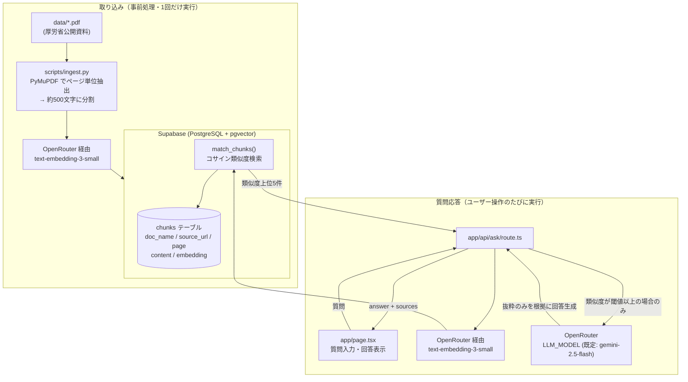

# 介護資料 根拠付きQ&A（試作）

*[English version here](README.en.md)*

介護（喀痰吸引・経管栄養）に関する厚生労働省の公開資料をもとに、
根拠（資料名・ページ・原文PDFへのリンク）を明示しながら質問に回答する
試作デモです。

## 概要

- ユーザーが日本語で質問すると、事前に取り込んだ PDF から関連箇所を
  ベクトル検索で抽出し、その抜粋のみを根拠に LLM が回答を生成します。
- 回答の各文には `[1]` のような根拠番号が付き、クリックすると該当する
  出典（資料名・ページ・抜粋テキスト・原文PDFへのリンク）にジャンプできます。
- 関連する記載が資料に見つからない場合は、LLM を呼び出さずに
  「資料に記載がありません。」と即座に返答し、ハルシネーションを防ぎます。

## 使用資料

厚生労働省が公開している喀痰吸引等研修関連の資料 5 点を使用しています。

| 資料名 | 出典URL |
|---|---|
| 喀痰吸引（第三号研修テキスト） | https://www.mhlw.go.jp/seisakunitsuite/bunya/hukushi_kaigo/shougaishahukushi/kaigosyokuin/dl/text_03.pdf |
| 経管栄養（第三号研修テキスト） | https://www.mhlw.go.jp/seisakunitsuite/bunya/hukushi_kaigo/shougaishahukushi/kaigosyokuin/dl/text_07.pdf |
| 喀痰吸引等研修Q&A（第三号研修テキスト） | https://www.mhlw.go.jp/seisakunitsuite/bunya/hukushi_kaigo/shougaishahukushi/kaigosyokuin/dl/text_10.pdf |
| 喀痰吸引等研修の研修課程 | https://www.mhlw.go.jp/seisakunitsuite/bunya/hukushi_kaigo/seikatsuhogo/tannokyuuin/dl/4-1-1-1.pdf |
| 喀痰吸引等業務に関するQ&A（その2） | https://www.mhlw.go.jp/seisakunitsuite/bunya/hukushi_kaigo/seikatsuhogo/tannokyuuin/dl/2-6-4-4.pdf |

## アーキテクチャ



## セットアップ手順

### 1. 前提

- Node.js 18 以上
- Python 3.10 以上
- Supabase プロジェクト（pgvector 拡張が有効化できること）
- OpenRouter の API キー（埋め込み・LLM の両方をこれ経由で呼び出します）

### 2. 依存パッケージのインストール

```bash
npm install
pip install -r scripts/requirements.txt
```

### 3. 環境変数の設定

`.env.example` を `.env` にコピーし、値を埋めてください。

```bash
cp .env.example .env
```

| 変数名 | 説明 |
|---|---|
| `SUPABASE_URL` | Supabase プロジェクトの URL |
| `SUPABASE_SERVICE_ROLE_KEY` | Supabase の service_role（secret）キー。取り込みスクリプトと API から書き込み・検索に使用 |
| `OPENAI_API_KEY` | 埋め込み生成用。本プロジェクトでは OpenRouter 経由で `openai/text-embedding-3-small` を呼び出すため、OpenRouter の API キーを設定してください |
| `OPENROUTER_API_KEY` | LLM 呼び出し用の OpenRouter API キー |
| `LLM_MODEL` | 回答生成に使う OpenRouter 上のモデル ID（既定値: `google/gemini-2.5-flash`） |

### 4. データベースのセットアップ

Supabase の SQL Editor で [supabase/schema.sql](supabase/schema.sql) の内容を実行してください。
`vector` 拡張の有効化、`chunks` テーブル、HNSW インデックス、`match_chunks` 関数が作成されます。

### 5. PDF の取り込み

`data/` フォルダに 5 件の PDF を配置した状態で実行します。

```bash
python scripts/ingest.py
```

既存データを削除してから再登録するため、何度実行しても重複しません。
実行後、ページ数・チャンク数・ほぼ空白のページ数のサマリーが表示されます。

### 6. アプリの起動

```bash
npm run dev
```

http://localhost:3000 にアクセスしてください。

## 工夫した点

- **出典の明示**: 回答の各文に `[1]` のような根拠番号を付与し、資料名・ページ・
  抜粋・原文PDFへのリンク（`#page=X` 付き）にひも付けています。ユーザーが
  回答の正しさを自分で検証できるようにしました。
- **「記載なし」判定によるハルシネーション対策**: 検索結果の最上位の類似度が
  閾値（既定 0.3）未満の場合は LLM を呼び出さず、即座に
  「資料に記載がありません。」と返します。関連性の低い抜粋を無理に使って
  LLM が答えを作り出してしまうリスクを構造的に排除しています。
- **プロンプトによる根拠限定**: システムプロンプトで「提供された抜粋のみを
  根拠にする」「推測や一般知識で補わない」ことを明示的に指示し、
  temperature 0 で回答のブレを抑えています。
- **PDF テキスト抽出ライブラリの選定**: 当初想定していた `pypdf` では、
  一部の PDF（第三号研修テキスト系）でフォントの文字コード変換に起因する
  文字化けが発生することが判明したため、`PyMuPDF`（fitz）に切り替えて
  正しい日本語テキストを抽出しています。

## 今後の改善

- **ハイブリッド検索**: ベクトル検索に加えてキーワード検索（BM25等）を
  組み合わせ、固有名詞や制度名などの完全一致が重要な質問への精度を向上する。
- **リランキング**: 検索結果上位候補を専用のリランカーモデルで並べ替え、
  LLM に渡す抜粋の質を高める。
- **経営データとのSQL連携**: 施設の稼働率・人員配置などの内部データベースと
  連携し、資料検索と数値データ照会を組み合わせた回答を可能にする。
- **評価セット**: 想定質問と正解根拠のペアからなる評価セットを整備し、
  検索精度・回答の正確性を継続的に計測できるようにする。

## 免責事項

本デモは公開資料に基づく試作であり、専門的な判断の代わりにはなりません。
